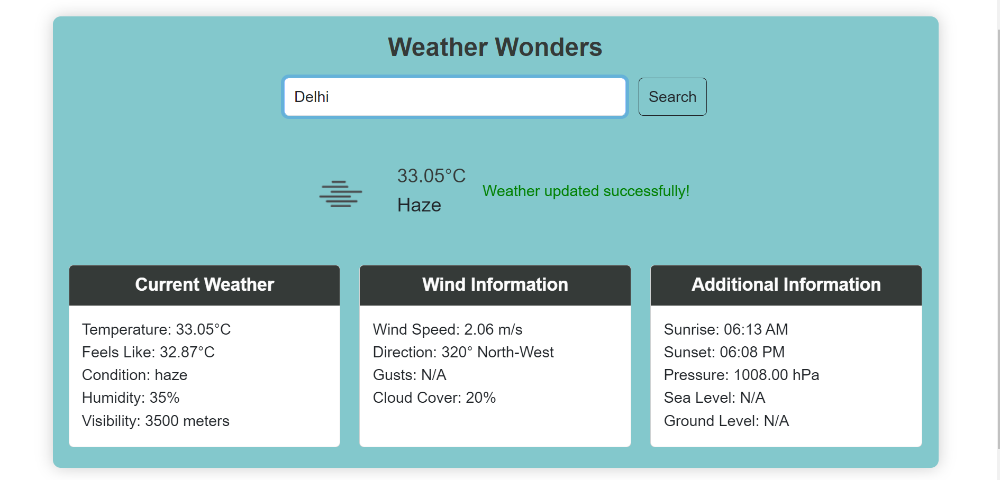

# Weather App




## Description

The Weather App is a web application that allows users to check the current weather conditions for a specific city. It leverages the OpenWeatherMap API to fetch real-time weather data and provides users with key information such as temperature, wind speed, humidity, and more.
## Demo

Explore the live demo of the Weather App [Click Here](https://ganeswar07.github.io/Weather-App/).

## Features

- **Current Weather Display:** View the current temperature, weather condition, and an icon representing the weather for the specified city.
- **Detailed Weather Information:** Explore additional details such as temperature feels like, wind information, humidity, visibility, and more.
- **Responsive Design:** The app is designed to work seamlessly across different devices and screen sizes.
- **Loading Spinner:** A visually appealing loading spinner is displayed while waiting for weather data.


## Getting Started

These instructions will help you set up and run the Weather App on your local machine.

1. **Clone the repository:**
   ```bash
   git clone https://github.com/ganeswar07/Weather-App.git
   ```

2. **Navigate to the project directory:**
   ```bash
   cd Weather-App
   ```

3. **Open index.html in your web browser:**
   Double-click on `index.html` or open it with your preferred web browser.

4. **Enter a City Name:**
   Type the name of the city for which you want to check the weather and click the "Search" button.

5. **Explore Weather Details:**
   View the current weather and additional details presented in a user-friendly card layout.

## Contributing Guidelines

If you would like to contribute to the project, please follow these guidelines:

- **Bug Reports:**
- Check the existing [issues](https://github.com/ganeswar07/Weather-App/issues) to see if the bug has already been reported.

  - If not, create a new issue with a clear and detailed description. Include information such as the steps to reproduce the bug, expected behavior, and your environment (browser, operating system).

- **Feature Requests:**
  - If you have a feature request or an idea for an improvement, open a new issue:
    - Clearly describe the proposed feature or enhancement.
    - Provide any relevant context or use cases that might help in understanding the request.

- **Pull Requests:**
  - We welcome contributions! If you want to contribute to the Weather App:
    - Fork the repository and create a new branch for your feature or bug fix.
    - Make your changes and ensure that your code follows the project's coding style.
    - Write meaningful commit messages.
    - Test your changes thoroughly.
    - Open a pull request, describing the changes you made and any additional information that might be helpful for review.

- **Coding Style:**
  - Please follow the existing coding style used in the project. Consistency makes it easier for everyone to read and maintain the codebase.

- **API Key Validation:**
  - Ensure that OpenWeatherMap API key is valid.
  - If you encounter issues with the API key, please go to the [OpenWeatherMap website](https://openweathermap.org/) and obtain your own API key.


## Acknowledgments

- [OpenWeatherMap](https://openweathermap.org/) for providing the weather data API.


## Contact

Ganeswar Sahoo - [GitHub Profile](https://github.com/ganeswar07)

Feel free to reach out if you have any questions or suggestions!
